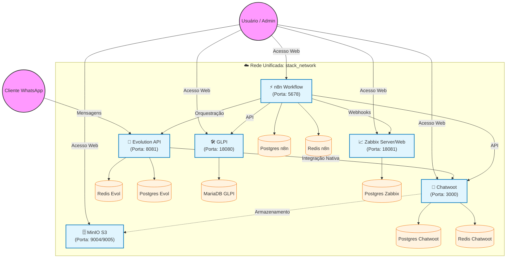

# 🚀 Stack ITSM, Monitoramento & Automação (GLPI + Zabbix + Chatwoot + Evolution API)

> 🚨 **DOCUMENTAÇÃO OFICIAL DO AMBIENTE (192.168.29.71)** 🚨
> 
> Para detalhes específicos desta implantação, incluindo IPs, credenciais e scripts de validação, consulte o:
> 
> 👉 **[MANUAL DE IMPLANTAÇÃO E OPERAÇÃO](./MANUAL_DE_IMPLANTACAO.md)** 👈
>
> *Use o manual acima como referência primária para manutenção.*

Este repositório contém a infraestrutura completa, orquestrada via Docker Compose, para uma suíte de Gestão de Serviços de TI (ITSM), Monitoramento de Infraestrutura e Atendimento Omnichannel.

O projeto foi desenhado para ser modular, escalável e seguro, utilizando segmentação de redes e persistência de dados.

---

## 📋 Índice
1. [Arquitetura da Solução](#-arquitetura-da-solução)
2. [Fluxograma de Dados](#-fluxograma-de-dados)
3. [Componentes da Stack](#-componentes-da-stack)
4. [Pré-requisitos](#-pré-requisitos)
5. [Instalação e Deploy](#-instalação-e-deploy)
6. [Pós-Instalação (Setup Inicial)](#-pós-instalação-setup-inicial)
7. [Estrutura de Diretórios](#-estrutura-de-diretórios)
8. [Troubleshooting](#-troubleshooting)
9. [Integração WhatsApp -> GLPI](#-integração-whatsapp---glpi)

---

## 🏛 Arquitetura da Solução

A infraestrutura utiliza uma **rede virtual unificada** (`stack_network`) para facilitar a comunicação entre todos os serviços, mantendo a organização lógica através da orquestração via Docker Compose.

*   **`stack_network`:** Rede compartilhada por todos os componentes (GLPI, Zabbix, Chatwoot, Evolution API, MinIO e n8n), permitindo comunicação direta e eficiente via DNS interno do Docker.

O **n8n** atua como o **Hub de Integração**, orquestrando os fluxos de dados entre os serviços.

---

## 🔄 Fluxograma de Dados

Abaixo, o diagrama detalhado das conexões, redes e fluxo de dados entre os serviços.



---

## 🧩 Componentes da Stack

### 1. **GLPI (v11.0.1)**
*   **Função:** Service Desk, Gestão de Ativos (CMDB) e Rastreamento de Problemas.
*   **Imagem:** `glpi/glpi:11.0.1`
*   **Banco:** MariaDB 10.11

### 2. **Chatwoot (v4.8.0)**
*   **Função:** Plataforma de atendimento ao cliente (Live Chat, WhatsApp, Email).
*   **Imagem:** `chatwoot/chatwoot:v4.8.0` (Edição Community)
*   **Recursos:** Suporte a `pgvector` para funcionalidades de IA.

### 3. **Zabbix (v7.0 LTS)**
*   **Função:** Monitoramento de redes, servidores e aplicações em tempo real.
*   **Imagem:** Alpine based (leve e segura).

### 4. **Evolution API (Latest)**
*   **Função:** Gateway para conexão com o WhatsApp (baseado na biblioteca Baileys).
*   **Recursos:** Multi-sessão, envio de mídia, webhooks.

### 5. **n8n**
*   **Função:** Orquestrador de automação "Low-code". Conecta todos os serviços acima.

### 6. **MinIO**
*   **Função:** Object Storage compatível com S3.
*   **Uso:** Armazenamento centralizado de arquivos (anexos do Chatwoot, backups).

---

## ⚙️ Pré-requisitos

Para rodar esta stack, seu servidor deve atender aos requisitos mínimos:

*   **Sistema Operacional:** Linux (Ubuntu 22.04+ recomendado) ou Windows (com WSL2).
*   **Docker:** Versão 24.0+
*   **Docker Compose:** Versão 2.20+
*   **Hardware Recomendado:**
    *   **CPU:** 4 vCPUs
    *   **RAM:** 8GB+ (O Zabbix e GLPI juntos consomem consideravelmente, e o Java do Elasticsearch [se adicionado futuramente] demandaria mais).
    *   **Disco:** 50GB SSD livre.

---

## 🚀 Instalação e Deploy

### Opção A: Deploy Padrão (Docker Compose)

1.  Clone este repositório:
    ```bash
    git clone https://github.com/seu-usuario/GLPI-EVOLUTION-ZABBIX.git
    cd GLPI-EVOLUTION-ZABBIX
    ```

2.  Configure as variáveis de ambiente:
    ```bash
    cp .env.example .env
    # Edite o .env se necessário (senhas, chaves de API)
    ```

3.  Inicie a stack:
    ```bash
    docker compose up -d
    ```

### Opção B: Deploy no aaPanel (Ubuntu/CentOS)

Se você utiliza o painel de gerenciamento **aaPanel**, você tem duas opções de acesso:

#### 1. Acesso Direto via IP (Sem Proxy Reverso)
Para testar a stack sem configurar domínios, você pode acessar os serviços diretamente pelo IP do servidor.
**Importante:** Você precisa liberar as seguintes portas no firewall do aaPanel e do seu provedor de Cloud (AWS/DigitalOcean/etc):
*   `3000` (Chatwoot)
*   `18080` (GLPI)
*   `18081` (Zabbix)
*   `5678` (n8n)
*   `8081` (Evolution API)
*   `9004/9005` (MinIO)

#### 2. Configuração com Proxy Reverso (Com Domínios - Recomendado para Produção)
Quando quiser configurar domínios (SSL/HTTPS), siga estes passos:

1.  Instale o "Docker Manager" na loja de aplicativos do aaPanel.
2.  Faça o upload dos arquivos deste projeto para uma pasta (ex: `/www/wwwroot/stack-itsm`).
3.  Pelo terminal do aaPanel, navegue até a pasta e rode `docker compose up -d`.
4.  Crie sites (domínios ou subdomínios) para cada serviço e configure o **Reverse Proxy**:

| Serviço | Porta Local | Configuração no aaPanel |
| :--- | :--- | :--- |
| **Chatwoot** | `3000` | Crie site `chat.seudominio.com` > Config > Reverse Proxy > Target: `http://127.0.0.1:3000` |
| **GLPI** | `18080` | Crie site `suporte.seudominio.com` > Config > Reverse Proxy > Target: `http://127.0.0.1:18080` |
| **Zabbix** | `18081` | Crie site `monitor.seudominio.com` > Config > Reverse Proxy > Target: `http://127.0.0.1:18081` |
| **n8n** | `5678` | Crie site `n8n.seudominio.com` > Config > Reverse Proxy > Target: `http://127.0.0.1:5678` |
| **Evolution API**| `8081` | Crie site `api.seudominio.com` > Config > Reverse Proxy > Target: `http://127.0.0.1:8081` |
| **MinIO API** | `9004` | Crie site `s3.seudominio.com` > Config > Reverse Proxy > Target: `http://127.0.0.1:9004` |
| **MinIO Console**| `9005` | Crie site `minio.seudominio.com` > Config > Reverse Proxy > Target: `http://127.0.0.1:9005` |


---

## 🏁 Pós-Instalação (Setup Inicial)

Após subir os containers, aguarde alguns minutos para que os bancos de dados sejam inicializados.

*   **Acesse o GLPI:** `http://localhost:18080` (User: `glpi` / Pass: `glpi`)
*   **Acesse o Chatwoot:** `http://localhost:3000` (Crie sua conta de admin na tela inicial)
*   **Acesse o Zabbix:** `http://localhost:18081` (User: `Admin` / Pass: `zabbix`)
*   **Acesse o n8n:** `http://localhost:5678` (Crie seu usuário admin)

---

## 📂 Estrutura de Diretórios

```plaintext
.
├── compose.yaml          # Arquivo central de orquestração
├── .env                  # Variáveis de ambiente globais
├── README.md             # Documentação do projeto
│
├── Chatwoot/
│   └── compose.yaml      # Definição do Chatwoot + Postgres/Redis dedicados
│
├── GLPI/
│   └── glpi.yml          # Definição do GLPI + MariaDB
│
├── Zabbix/
│   └── zabbix.yml        # Definição do Zabbix Server/Web/Agent
│
├── evolution/
│   └── compose.yaml      # Definição da API de WhatsApp
│
├── n8n/
│   └── compose.yaml      # Definição do n8n + Redis/Postgres dedicados
│
└── minio/
    └── compose.yaml      # Definição do Object Storage
```

---

## 🛡️ Segurança e Firewall (Acesso Externo)

 Para acessar as aplicações externamente (fora do servidor), você deve configurar as regras de firewall e, se não usar proxy reverso, ajustar os binds dos containers. Para **comunicação interna entre serviços**, prefira sempre os **nomes dos serviços** (DNS do Docker), evitando dependência de IPs.

### 1. Portas da Stack

| Aplicação | Porta Externa | Descrição |
| :--- | :--- | :--- |
| **Chatwoot** | `3000` | Interface Web e API |
| **n8n** | `5678` | Editor de Workflow e Webhooks |
| **Evolution API** | `8081` | API do WhatsApp |
| **GLPI** | `18080` | Sistema de Chamados |
| **Zabbix Web** | `18081` | Painel de Monitoramento |
| **Zabbix Server** | `11051` | Recebimento de dados dos Agentes |
| **MinIO API** | `9004` | Upload de Arquivos (S3) |
| **MinIO Console** | `9005` | Painel de Administração de Arquivos |

### 2. Comandos para Liberar no Firewall (Ubuntu/UFW)

```bash
# Habilita o firewall
sudo ufw enable

# Portas padrão
sudo ufw allow 22/tcp
sudo ufw allow 80/tcp
sudo ufw allow 443/tcp

# Portas da Stack
sudo ufw allow 3000/tcp comment 'Chatwoot'
sudo ufw allow 5678/tcp comment 'n8n'
sudo ufw allow 8081/tcp comment 'Evolution API'
sudo ufw allow 18080/tcp comment 'GLPI'
sudo ufw allow 18081/tcp comment 'Zabbix Web'
sudo ufw allow 11051/tcp comment 'Zabbix Server Trapper'
sudo ufw allow 9004/tcp comment 'MinIO API'
sudo ufw allow 9005/tcp comment 'MinIO Console'

# Aplicar regras
sudo ufw reload
```

**Nota para aaPanel:** Adicione estas mesmas portas em **Security > Firewall** no painel visual.

### 3. Liberar Acesso Direto (Sem Proxy Reverso)

Por padrão, esta stack vem configurada para **Produção Segura** (bind em `127.0.0.1`). Para acessar via IP direto (`http://192.168.29.71:PORTA`), remova a restrição de localhost rodando este comando na raiz do projeto:

```bash
# Remove "127.0.0.1:" dos arquivos compose
find . -type f \( -name "compose.yaml" -o -name "*.yml" \) -exec sed -i 's/127.0.0.1://g' {} +

# Reinicie a stack
docker compose down
docker compose up -d
```

---

## 🔧 Troubleshooting

### Chatwoot não mostra tela de cadastro
Execute o reset forçado do banco de dados (CUIDADO: Apaga dados do Chatwoot):
```bash
docker compose -f Chatwoot/compose.yaml down -v
docker compose -f Chatwoot/compose.yaml up -d
docker compose -f Chatwoot/compose.yaml exec web bundle exec rails db:create db:schema:load db:seed
```

### Erro de Conexão no Banco
Verifique se o container do banco está saudável:
```bash
docker compose ps | grep db
```
Se o banco reiniciar em loop, verifique os logs:
```bash
docker compose logs chatwoot-db
```
*Geralmente é erro de senha ou permissão de volume.*

### Portas Ocupadas
Se receber erro `Bind for 0.0.0.0:8080 failed: port is already allocated`, edite o `.env` ou os arquivos `compose.yaml` para alterar a porta externa (ex: mudar `8081:8080`).

---

## 📲 Guias de Integração (Detalhado)

Para configurar a automação completa e o armazenamento de arquivos, consulte os guias dedicados:

1.  **Integração de Mensagens (Fluxo Principal)**:
    *   Cobre desde a conexão do número na Evolution API até a criação de Webhooks no n8n.
    *   👉 **[Guia: WhatsApp (Evolution API) -> Chatwoot -> n8n](./INTEGRACAO_WHATSAPP.md)**

2.  **Integração de Armazenamento (MinIO)**:
    *   Configuração do S3 para salvar anexos do Chatwoot no MinIO local.
    *   👉 **[Guia: Chatwoot + MinIO (S3)](./INTEGRACAO_CHATWOOT_MINIO.md)**
